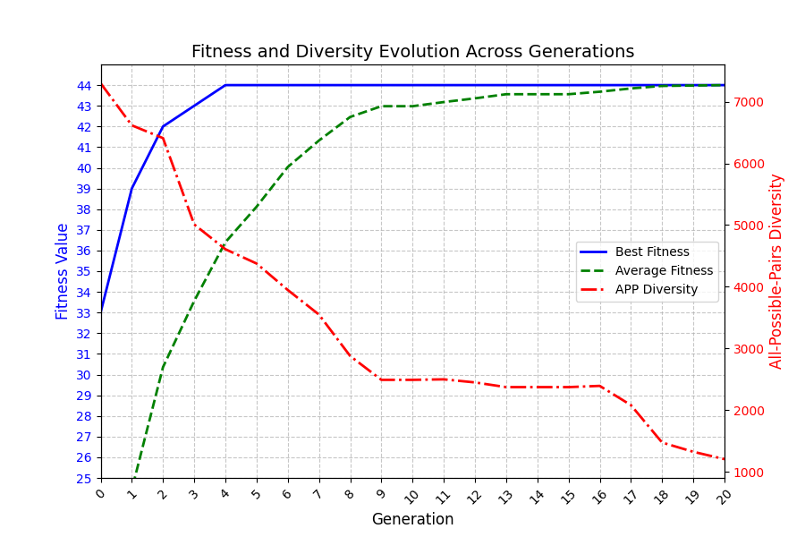

# CS131 A3 Genetic Algorithms
#### Bix von Goeler

A project implementing a basic genetic algorithm to solve the knapsack problem optimization challenge.

## Requirements
- Tested using `Python 3.11`
- Install: `numpy` for numerical operations and grid representation
- (Optionally) Install: `matplotlib` for visualization (will be disabled if not installed.)
- Or run: `pip install -r requirements.txt` inside project directory

## Running The Project
1. Run the project using `python main.py`
2. The evolution will run automatically, printing current generation stats to terminal, 
and once complete will display the best solution found.  
3. If matplotlib is found, a graph will display and save containing the 
best/average fitness and the All-Possible-Pairs-Diversity of each generation.
   
4. To change the parameters of the algorithm, edit the `config.py` file and rerun the program. 
The following parameters can be modified:
   - `POPULATION_SIZE`: Number of Individuals in each Generation (default 50)
   - `TOURNAMENT_SIZE`: Size of tournament for parent selection (default 3)
   - `GENERATIONS`: Number of generations to run the algorithm for (default 20)
   - `CROSSOVER_TYPE`: 'single' for single point, 'multi' for multipoint (default 'single')
   - `CROSSOVER_RATE`: Probability of a crossover between two parents (default 0.6)
   - `NUM_CROSSOVER_POINTS`: Number of crossover points for multipoint crossover (default 2)
   - `MUTATION_TYPE`: 'single' for single point, 'multi' for multipoint (default 'multi')
   - `MUTATION_RATE`: Probability of a mutation occurring in each offspring (default 0.9)
   - `MUTATION_MULTI_RATE`: Probability of each bit mutating in multipoint mutation (default 0.3)

## Analysis of Genetic Algorithm Structure and Design

### Problem Representation and Formulation
The genetic algorithm for the knapsack problem is structured around a binary genome 
representation where each bit corresponds to including or excluding a specific box. 
This approach is well-suited to the knapsack problem as it maps naturally to the 
binary decision (include/exclude) for each item.

### Selection and Evolutionary Mechanisms
The selection process employs tournament selection, which promotes competitive pressure while maintaining diversity:
- Randomly selected individuals compete in mini-tournaments (default size of 4)
- The individual with the highest fitness from each tournament becomes a parent
- This approach balances exploration and exploitation better than pure fitness-proportionate selection

The algorithm implements both single-point and multi-point crossover strategies:
- Single-point: Creates offspring by splitting and recombining parent genomes at one random position
- Multi-point: Splits genomes at multiple points, alternating segments between parents
- The crossover rate (default 30%) controls how frequently parents exchange genetic material

The algorithm implements both single-point and multi-point mutation strategies:
- Single-point: Flips a single random bit in the genome
- Multi-point: Each bit has a probability (default 30%) of flipping
- The high mutation rate (default 90%) ensures thorough exploration of the solution space

## Population Management and Culling

The population management strategy is:
- Initial population size of 50 individuals with random genomes ensuring diverse starting points
- Tournament winners create an additional 50 offspring each generation through crossover and mutation
- Offspring and parents are combined into a single population of 100 individuals.
- The combined population is sorted by fitness and culled by 50%.
- This approach ensures the best solutions remain while making room for innovation

## Performance Tracking and Analysis

The algorithm employs sophisticated metrics to track evolutionary progress:
- Best fitness: Tracks the highest fitness value in each generation
- Average fitness: Monitors the population's overall quality
- All-Possible-Pairs (APP) diversity: Measures genetic diversity using Hamming distance between all genome pairs
- The visualization shows the increasing fitness and decreasing diversity over time

## Design Assumptions and Constraints

Several key assumptions underpin the algorithm's design:
- Fixed genome length corresponding to exactly 12 boxes
- Fitness calculation assumes a fixed maximum weight (250)
- The algorithm assumes the knapsack can only include one of each box (no duplicates)
- Weight penalties for exceeding the knapsack limit are calculated as (max_weight - total_weight)
  to strongly penalize overfilling, while pushing overfills in the right direction. In testing
  with smaller weight limits, this approach was quite necessary as the random initial population
  was unable to compensate when all overweight solutions were given a fitness of 0.
